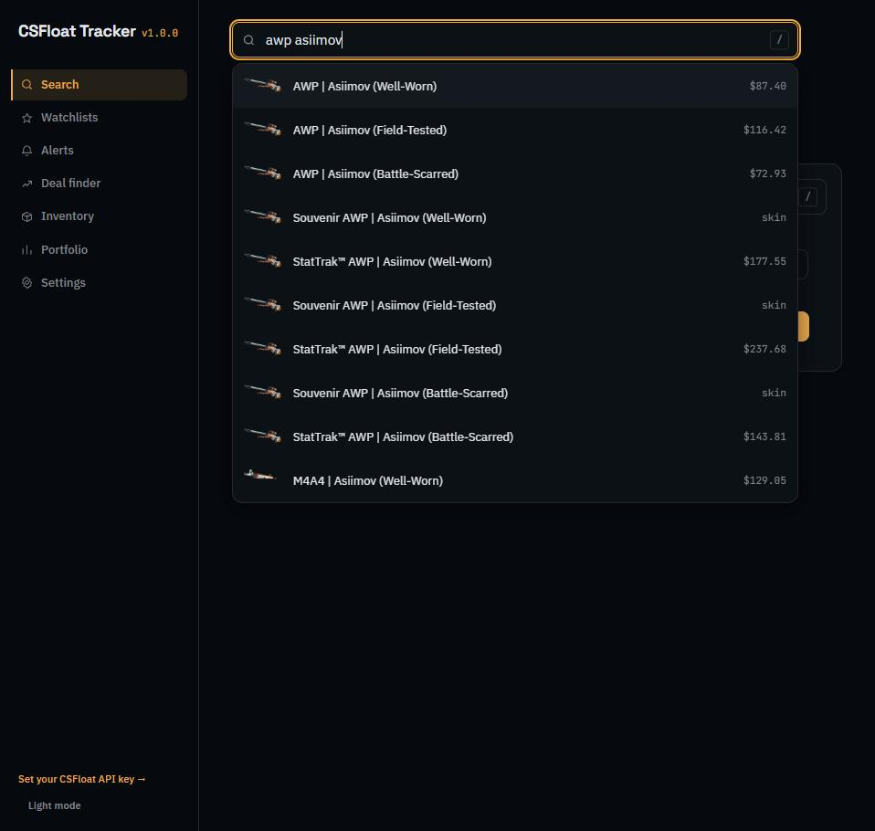
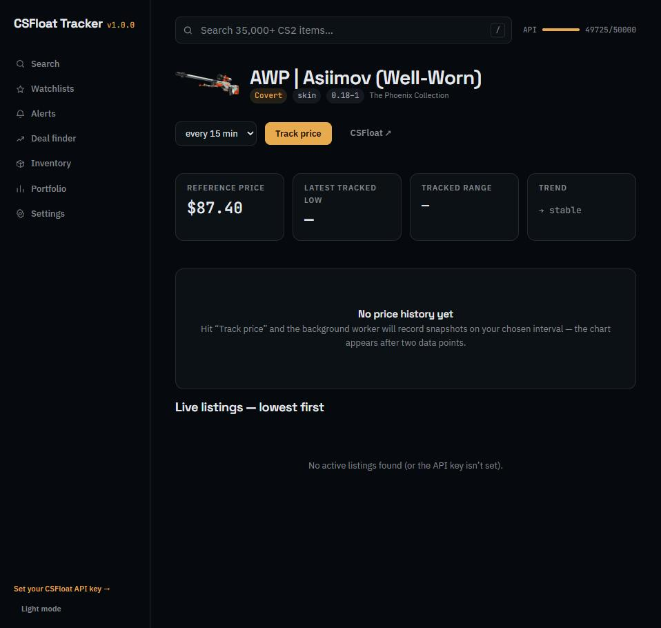

# CSFloat Tracker

**A free, open-source CS2 price tracker that runs on your own PC.**
Deal sniping with reasons, inventory valuation that survives Steam's rate
limits, price history, watchlists, alerts, and a "where should I actually
sell this?" fee breakdown — no account, no subscription, your data never
leaves your machine.


| Search 35,000+ items | Track any skin over time |
| --- | --- |
|  |  |

## Why not just browse CSFloat.com?

CSFloat is where the listings live — this tool is what watches them **for
you**, around the clock:

- **The deal finder tells you *why* something is cheap.** Not just "18%
  below reference" but *"top 1% float for FT"* or *"costs less than the MW
  reference"* or *"~$40 in stickers included"*. It scans the newest listings
  continuously and pings you (in-app or Discord) the moment something good
  appears — the stuff that's gone by the time you'd have refreshed a browser
  tab.
- **Price history nobody else keeps for you.** Track any skin at 1-minute to
  daily intervals; your own local database builds charts of lowest/average
  price and listing volume. Your inventory's total value is snapshotted on
  every load, so you can see "up $31 since last week" at a glance.
- **The fee math is done for you.** Every item page shows what you'd
  actually pocket selling at CSFloat (2%), Buff163 (2.5%), DMarket (~5%),
  Skinport (12%) or the Steam Market (15%, and the money never leaves
  Steam). No more selling on the wrong platform.
- **Inventory valuation that actually works.** Steam has rate-limited
  inventory fetches into the ground since April 2024. The Manual Load flow
  (SkinSearch-style) sidesteps it: open two links in your own browser, paste,
  done — including the trade-protected items other tools miss.
- **Alerts with float rules.** "Tell me when a Karambit Doppler FN goes
  under $1,100" or "any Redline below 0.16 float" — checked every minute,
  fired once per listing, logged.
- **It's yours.** Runs locally, MIT-licensed, SQLite you can open yourself,
  no telemetry, no login. The only account involved is your own free CSFloat
  API key, stored in your OS keychain.

New to floats, patterns, trade locks or fees? The built-in **Guide** page
explains the whole game in five minutes.

## Quick start

### Download (easiest)

Grab the latest `CSFloatTracker-Windows.exe` from [Releases](../../releases),
double-click it, and your browser opens automatically. No Python, no Node, no
terminal. A tray icon (amber trend-line) holds the *Open* and *Quit* actions;
your data lives in `%APPDATA%\csfloat-tracker` between runs.

Linux and macOS builds are also on the Releases page (console binaries —
`Ctrl+C` to quit).

**First run:** search and inventory valuation work immediately, no key
needed. For live listings, tracking, alerts and the deal finder, grab a free
API key from [csfloat.com](https://csfloat.com) (Steam sign-in → Developers →
new key) and paste it into *Settings*. It's validated before being stored —
in your OS keychain, never in a file you might accidentally share.

### Docker

```bash
git clone https://github.com/MhmdMK277/CSFloatPriceChecker.git
cd CSFloatPriceChecker
docker compose up --build     # → http://localhost:8422
```

### From source

Requirements: Python ≥ 3.11, Node ≥ 20. [`uv`](https://docs.astral.sh/uv/) recommended.

```bash
git clone https://github.com/MhmdMK277/CSFloatPriceChecker.git
cd CSFloatPriceChecker
uv venv .venv && uv pip install -e ".[dev]" --python .venv
cd frontend && npm install && npm run build && cd ..
.venv/bin/csfloat-tracker serve        # Windows: .venv\Scripts\csfloat-tracker serve
```

Or with `make`: `make setup && make serve` (`make dev` for hot reload).

## What's inside

| Page | What it does for you |
| --- | --- |
| **Search** | Autocomplete over 35,000+ market names (skins, knives, gloves, stickers, cases, charms…); wear/float/price filters; every listing shows full-precision float, paint seed, stickers, seller history and % vs reference price |
| **Deal finder** | Continuous scan of the newest listings vs reference prices, with the *reason* each deal is a deal; budget caps and thresholds you control |
| **Inventory** | Profile-URL import, rate-limit-proof Manual Load (both tradable and trade-protected contexts), instant valuation, value-over-time history |
| **Watchlists** | Named groups with per-item deltas and group totals; one-click refresh; CSV export |
| **Alerts** | Price and float rules, checked every minute, in-app + Discord webhook, full trigger log |
| **Portfolio** | Log your buys; live unrealized P&L and ROI against current reference prices |
| **Guide** | Floats, patterns (blue gems, Doppler phases, fades), trade locks, marketplace fees — plain-language education |
| **CLI** | `csfloat-tracker search / price / refresh-db / serve` for terminal people |

## How the data works

The item catalog rebuilds itself from CSFloat's public schema (per-wear
reference prices included) and auto-refreshes when older than 7 days — no
more shipping a stale item list. Reference prices power the deal finder,
inventory totals and P&L without spending API budget; live listings come
from CSFloat's market API through a rate-limit-aware client that backs off
politely and shows you its remaining budget in the top bar.

Architecture details in [docs/ARCHITECTURE.md](docs/ARCHITECTURE.md).

## Contributing

PRs welcome — see [CONTRIBUTING.md](CONTRIBUTING.md). Short version:
`make setup`, `make test` (112 tests), `make lint`, conventional commits.

## Non-goals

No auto-buy/sell bot, no ToS-violating scraping, no external services
receiving your API key, no crypto.

## License

[MIT](LICENSE). Not affiliated with CSFloat or Valve. CS2 item names and
images belong to their respective owners.
